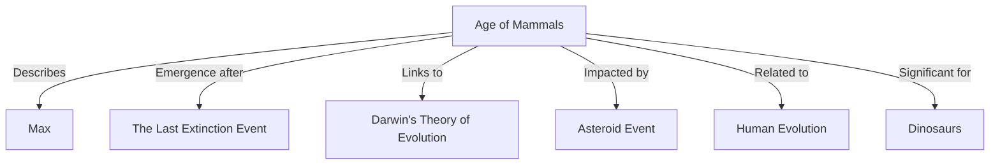

## Ways To Query The LighRAG Server

## Query 1

### LightRAG server will produce links which will bring you to the exact spot in a video where the query is addressed.

The magic which make this possible is in the way the data was prepared and indexed.  
[This library](https://github.com/johnshearing/scrape_yt_mk_transcripts) was used to prepare the data for indexing.  
 
How the query is written also matters. The following is an example. 

**Paste the following query into the LightRAG server prompt box.**

/naive [Time stamps in the source text appear like the following sample: [6.56 > 11.68]. The values given between the brackets are in seconds and decimal fractions of a second, not in minutes. Provide the full URLs including timestamped points in the source video so that the videos can be viewed at the moment of interest.] Please search for all instances where topical sunscreen is discussed.

**The following is was the response produced**

### Instances Discussing Topical Sunscreen

1. **Timestamp: [8261.02 > 8267.42]**
   - **Content:** The centralized medical dogma suggests that total cumulative UV light exposure causes skin cancer and recommends completely avoiding UV light and blocking it with topical sunscreen.
   - **Video URL:** [Watch here](https://www.youtube.com/watch?v=Ln3WszTq0uA&t=8261s)

2. **Timestamp: [8339.26 > 8345.42]**
   - **Content:** It is mentioned that putting chemicals or things on the skin that block the system (like topical sunscreen) guarantees an increased risk of melanoma.
   - **Video URL:** [Watch here](https://www.youtube.com/watch?v=Ln3WszTq0uA&t=8339s)

### Summary
The discussion around topical sunscreen highlights a critical view of its use in preventing skin cancer, suggesting that blocking UV light with sunscreen may lead to adverse health outcomes, including an increased risk of melanoma.

### References
- [DC] Ln3WszTq0uA.txt
- [DC] Ln3WszTq0uA_metadata.json
 

---
#### The following explains the effect of the query formating in the above example

* "/naive" was specified as the query method.
  * Methods available are naive, local, global, hybrid, mix, and bypass.
    * naive only looks in the vector database for information but will give thoughtfull answers beyond what it finds. So it's not just searching for words. Rather it is searching for meaning and reporting on that.
    * local seems to use information found in the knowledge graph nodes.
    * global seems to uses information found in knowledge graph relations.
    * hybrid seems to combines local and global methods.
    * mix combines seems to combine hybrid with naive
    * The results vary significantly based on the method used.
    * There is no tell which will give the best result so it is good to try them all. 
    * The python script _2_index_query_??.py does indeed try all the methods so it might be wise to run the query in the script first to see which method produces the best response and then run the query again in the LightRAG server to get the best formatting.

* [Time stamps in the...] 
  * Specify special instructions or formating instructions in brackets before the query. This greatly improves the quality of the response.  

## Query 2

### Metadata: LightRAG server will list data about the source material and produce links to that source material.

The magic which make this possible is in the way the data was prepared and indexed.  
[This library](https://github.com/johnshearing/scrape_yt_mk_transcripts) was used to prepare the data for indexing.  
 
How the query is written also matters. The following is an example. 

**Paste the following query into the LightRAG server prompt box.**

/naive Please list the metadata for the source material.  

**The following is was the response produced**

### Metadata for the Source Material
- **Video Title:** Dr Jack Kruse: Light, Melanin, POMC in Human Evolution & Disease
- **Video URL:** [Watch here](https://www.youtube.com/watch?v=Ln3WszTq0uA)
- **Video Platform:** YouTube
- **Video Channel:** Max Gulhane MD
- **Posted Date:** April 2, 2023
- **Language:** English

### References
- [DC] Ln3WszTq0uA_metadata.json

## Query 3

### LightRAG server will produce diagrams.

How the query is written matters. 
The query type is specified first: /naive 
Special instructions about the output go in between brackets []
Finally the query is written.
The following is an example. 

**Paste the following query into the LightRAG server prompt box.**

>/mix [Use mermaid format for diagrams] Please draw a character relationship diagram for Age of Mammals

**The following is was the response produced**

### Explanation:
- The diagram illustrates the relationships surrounding the "Age of Mammals," showing its connections to key entities such as Max, the Last Extinction Event, Darwin's Theory of Evolution, the Asteroid Event, Human Evolution, and Dinosaurs. Each relationship highlights how these entities are interconnected in the context of evolutionary history.

## Query 4

### LightRAG can find orphans in the knowledge graph.

This only works in a mixed mode query.  
The query type is specified first: /mixed  
Special instructions about the output go in between brackets []  
Finally the query is written.  

The following is an example.   
**Paste the following query into the LightRAG server prompt box.**

>/mix [Only provide the name of the entity in the response. Nothing else is required.] Please examine the Entity ID for all Entities in the following python list. Then please return only the Entities with a Rank of 0. [ "2023-04-02T06:06:17Z", "2023-04-22T23:01:27Z", "Alabama", "Albury", "Biological Compartments", "Cellular Health", "Circadian Biology", "Circadian Health", "Circadian Rhythm", "Cold Thermogenesis Protocol", "Cytochrome C Oxidase", "Delta Airlines", "Deuterium Depleted Water", "Dr Jack Kruse: Light, Melanin, POMC in Human Evolution & Disease", "Dr Jack Kruse: WATER, non-native EMFs & mitochondrial basis of disease | Regenerative Health Podcast", "Dr. Anthony Chafee", "Dr. Jack Kruse", "Dr. Max Gulhane", "Eureka Moment", "Farm Tour", "Health Optimization"]

**The following is was the response produced**

>The only Entity from your provided list with a Rank of 0 is:  
>
>Albury  
>This entity corresponds to the location in New South Wales where Dr. Max Gulhane is based.  

## Query 5

### LightRAG can find Type, Description, Rank, and File Path in the knowledge graph. In the previous example we searched from Entity to Entity ID to Rank in order to find orphans. In the following example we go through Entity to Entity ID to Type in order to return categories.

This only works in a mixed mode query.  
The query type is specified first: /mixed  
Special instructions about the output go in between brackets []  
Finally the query is written.  

The following is an example.   
**Paste the following query into the LightRAG server prompt box.**

>/mix [Only provide the name of the entity in the response. Nothing else is required.] Please examine the Entity ID for all Entities in the following python list. Then please return only the Entities with a Type of Person. [ "2023-04-02T06:06:17Z", "2023-04-22T23:01:27Z", "Alabama", "Albury", "Biological Compartments", "Cellular Health", "Circadian Biology", "Circadian Health", "Circadian Rhythm", "Cold Thermogenesis Protocol", "Cytochrome C Oxidase", "Delta Airlines", "Deuterium Depleted Water", "Dr Jack Kruse: Light, Melanin, POMC in Human Evolution & Disease", "Dr Jack Kruse: WATER, non-native EMFs & mitochondrial basis of disease | Regenerative Health Podcast", "Dr. Anthony Chafee", "Dr. Jack Kruse", "Dr. Max Gulhane", "Eureka Moment", "Farm Tour", "Health Optimization"]

**The following is was the response produced**

>Dr. Anthony Chafee  
Dr. Jack Kruse  
Dr. Max Gulhane    
